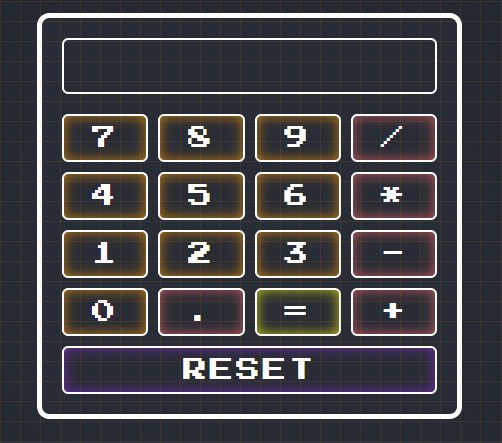

# React Calculator App 🧮



This project is a simple calculator app built using React. It allows users to perform basic arithmetic operations such as addition, subtraction, multiplication, and division.

## Prerequisites

Before running the React Calculator App, make sure you have the following software and tools installed on your machine:

- Node.js v18.10.0 or later
- npm (Node Package Manager) - this comes bundled with Node.js
- Visual Studio Code (or any other code editor of your choice)

## Installation

To install and run the React Calculator App, follow these steps:

1. Clone the repository from the `main` branch to your local machine:

```sh
git clone https://github.com/SMelidoni/react-calculator-app.git
```

Note: By default, the `develop` branch will be checked out. However, if you want to use the most stable version, please check out the `main` branch by running: `git checkout main`

2. Navigate into the project directory:

```sh
cd react-calculator-app
```

3. Install the dependencies:

```sh
npm install
```

4. Run the application:

```sh
npm start
```

You can then access the application by opening your web browser and navigating to http://localhost:3000.

## Usage

To use the calculator app, simply enter a number using the buttons provided, then select an operation (addition, subtraction, multiplication, or division) and enter another number. The app will display the result of the operation.

## Contributing

If you would like to contribute to this project, please follow these steps:

1. Fork the repository
2. Create a new feature branch `git checkout -b feature/new-feature`
3. Make your changes
4. Commit your changes: `git commit -am 'Add some feature'`
5. Push the branch: `git push origin feature/new-feature`
6. Submit a pull request

Thank you for checking out the React Calculator App!
